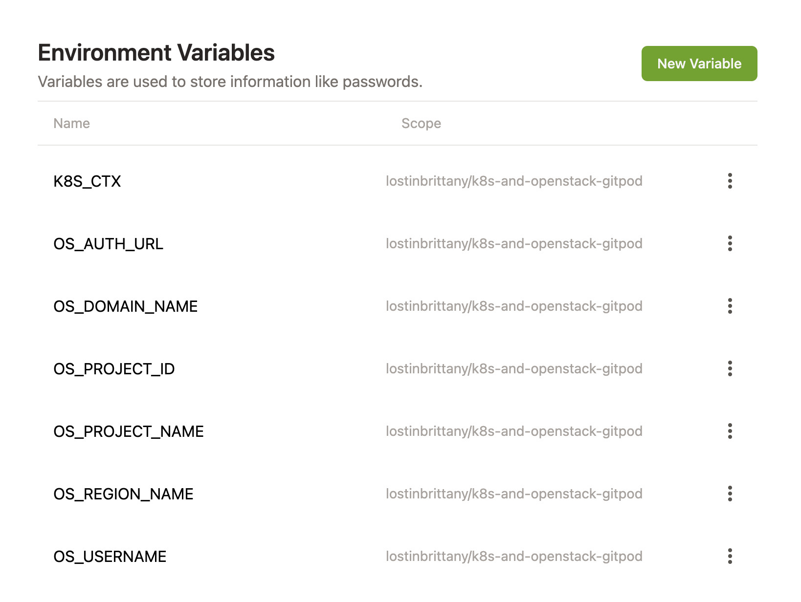

# Gitpod GitPod Workspace for OVHcloud Openstack and Kubernetes

A working Gitpod setup to work with OVHcloud Openstack and Managed Kubernetes. The workspace includes:

- For Openstack: Openstack, Nova and Swift clients

- For Kubernertes: Kubectl, Helm, Verlero & Kustomize.

To open the workspace, simply click on the *Open in Gitpod* button, or use [this link](https://gitpod.io/#https://github.com/LostInBrittany/k8s-and-openstack-gitpod.git).

[](https://gitpod.io/#https://github.com/LostInBrittany/k8s-and-openstack-gitpod.git)


## Configuring Openstack

To configure openstack, you need to setup Openstack authentication variables. There are two ways to do it:

- Copying the content of your `<user_name>-openrc.sh` file into a `openrc.sh` file in your workspace and source it: 

    ```bash
    source ./openrc.sh
    ```

- Using GitPod variables to define the following environment variables:

    ```bash
    # Keystone v2.0
    OS_AUTH_URL=<AUTH_URL /v2.0>
    OS_USERNAME=<USERNAME>
    OS_REGION_NAME=<REGION>

    # Keystone v3
    OS_AUTH_URL=<AUTH_URL /v3>
    OS_USERNAME=<USERNAME>
    OS_PROJECT_ID=<PROJECT_ID>
    OS_PROJECT_NAME=<PROJECT_NAME>
    OS_REGION_NAME=<REGION_NAME>
    OS_DOMAIN_NAME=<DOMAIN_NAME OR OS_USER_DOMAIN_NAME>
    ```

    Never add OS_PASSWORD as a Gitpod variable, the workspace will ask you for it after booting up.
     

## Configuring Kubeconfig

To administrate your Kubernetes cluster from Gitpod, you need to add your Kubeconfig to your Gitpod workspace. There are two ways to do it:

### 1- Copying the into your workspace

Copy your kubeconfig into a `~/.kube/config` file in your Gitpod workspace.

```bash
nano ~/.kube/config
```

### 2- Adding your kubeconfig as a Gitpod secret

Gitpod supports encrypted, user-specific environment variables. They are stored as part of your user settings and can be used to set access tokens, or pass any other kind of user-specific information to your workspaces.

To do it you need to follow this steps:

1. Convert Kubeconfig to base64

    ```bash
    cat kubeconfig | base64 -w 0
    ```

1. Copy Kubeconfig (base64 format) to Gitpod 

    

1. Configure the project to extract kubeconfig, by editing your `.gitpod.yml` file and add this following content:

    ```yaml
    tasks:
      - name: Set K8s context
        command: echo $KUBECONFIG | base64 -d > ~/.kube/config    
    ```


